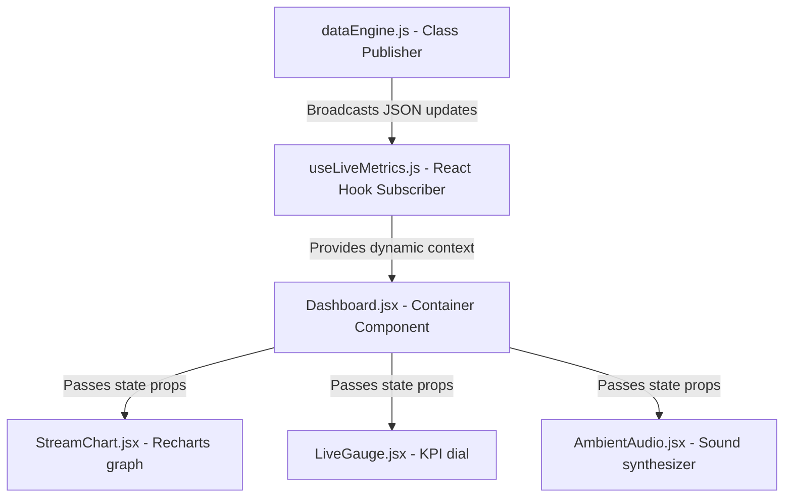

# Mind Metric — Advanced Real-Time Cognitive Analytics Console

Mind Metric is a responsive, client-side real-time data analytics dashboard designed to visualize cognitive telemetry metrics (Focus Score, Stress Level, Activity Index, Engagement Rate). 

Designed with a decoupled **Publisher-Subscriber architecture**, the interface is completely swap-ready. It can transition from simulated client-side telemetry to live physical EEG headbands (e.g. Muse) or eye-tracking streams with zero UI code refactoring.

---

## 📂 Directory Layout

```text
metric-mind/
├── src/
│   ├── components/         # Presentation HUD widgets and panels
│   │   ├── AmbientAudio.jsx # Focus ambient noise controller
│   │   ├── Annotations.jsx  # Context notes logging card
│   │   ├── BreaksPanel.jsx  # Guided breaks posture modal
│   │   ├── DailyGoals.jsx   # Goal progress & coherence streaks
│   │   ├── Dashboard.jsx    # Core controller container
│   │   ├── Header.jsx       # Global navigation controls
│   │   ├── KPICard.jsx      # Telemetry display cards
│   │   ├── LiveGauge.jsx    # Pie dial real-time status gauge
│   │   └── StreamChart.jsx  # Recharts streaming area visuals
│   ├── hooks/
│   │   └── useLiveMetrics.js# Core subscription hook
│   ├── lib/
│   │   ├── dataEngine.js    # Simulation publisher class
│   │   └── utils.js         # Sound alert synthesizer utilities
│   ├── App.jsx              # Main app bootstrapper
│   └── index.css            # Custom theme variables
├── README.md                # System documentation
└── package.json
```

---

## 🚀 Interactive Features List

### 1. Dynamic Simulation Presets (Profiles)
Change baseline simulation profiles on the fly via the Settings control panel. Metrics smoothly transition between targets using leaky integration walks:
- **Balanced Default**: Default baseline parameters.
- **Deep Focus Mode**: Shifts telemetry toward high focus and low stress.
- **High Stress Overload**: Shifts telemetry toward high stress and fatigue focus dips.
- **Calm Recovery State**: Shifts telemetry toward relaxed stress levels and low activity.

### 2. Interactive Biofeedback Breathing Trainer
Engage in a 4-4-4 box breathing task directly inside the console (Inhale, Hold, Exhale). Completing breathing cycles injects live positive offsets (`+3` Focus, `-5` Stress) directly back into the telemetry stream, providing real-time visual feedback on charts and gauges.

### 3. Natively Synthesized Ambient Soundscapes
Plays focus-assisting white noise, rain, and binaural beats natively using the browser's Web Audio API. Cutoff filter frequencies and pitch offsets dynamically adjust based on your current live Focus Score.

### 4. Micro-Break & Stretch Guide
A full-screen break overlay modal that triggers when neural stress runs high, or when manually launched. Guides users through quick physical stretches (neck release, shoulder rolls, wrist flexors) with countdown timers to release muscular tension.

### 5. Timeline Annotations (Notes)
Type annotations directly into the input HUD to attach contextual comments (e.g. "coffee kicked in", "phone call distraction") directly to the current chart timestamp. Notes render as interactive dashed marker lines directly on the streaming line area chart.

### 6. Daily Goals & Performance Streaks
Tracks target minutes spent in an optimal flow state, visualizing daily goals completions and showing streaks metrics.

### 7. Calendar Scheduling Overlay
Injects scheduling overlay markings (e.g. Standup Sync, Code Review) directly onto the charts to show how scheduled tasks correlate with focus levels.

### 8. Dynamic Visual Themes
Toggle dynamic UI themes inside the settings dashboard:
- **Space Console**: Slate-indigo dark HUD.
- **Neon Cyberpunk**: Pink neon borders, violet shadows, yellow highlights.
- **Matrix Digital**: Black terminal console with phosphor green layouts.

## 📖 Interactive User Walkthrough

This console provides interactive cognitive exercises and live interface modifiers. Here is how to use them during a session:

1. **Modify the Simulation Presets**:
   - Open the settings drawer (gear icon in the top right).
   - Locate the **Simulation Profile** dropdown.
   - Select **Deep Focus Mode** to watch focus levels rise and stress indicators fall, or select **High Stress Overload** to trigger safety limits breaches.
2. **Interact with the Bio-Feedback Breathing Trainer**:
   - Click the wind icon in the header navigation.
   - Follow the expanding/contracting circle guide (4s Inhale, 4s Hold, 4s Exhale).
   - Once you complete a breathing cycle (the "Hold" phase), notice the Focus score increases by `+3` and Stress decreases by `-5` instantly.
3. **Toggle Ambient Soundscapes**:
   - Find the **Ambient Soundscapes** card on the dashboard.
   - Select **Binaural Beats** or **Pink Noise** to activate browser-synthesized audio.
   - Change preset profiles or trigger anomalies to hear the audio frequency/filters adjust automatically to your Focus score.
4. **Log Context Timeline Notes**:
   - Locate the **Timeline Annotations** card.
   - Type a note (e.g. "writing documentation") and click the `+` button.
   - Look at the streaming line chart: a vertical dashed line with a 📝 icon will appear exactly at that time indicator.
5. **Calibrate Micro-Break Stretches**:
   - If stress indicators exceed safety limits for more than 5 ticks, or if you click the Shield alert button in the header, the **Micro-Break stretches modal** overlay appears.
   - Follow the steps to relax your neck, roll your shoulders, look away from the screen, and stretch your wrists.

## 🔌 Software Architecture & Pub/Sub Data Pipeline

Mind Metric uses a structured **Publisher-Subscriber pattern** to separate raw biometric data generation from the React rendering cycle.

### Data Flow Flowchart


### Swapping the Simulator for Physical Headbands (EEG)
To transition this simulator into a production setup using real wearable hardware (e.g. Muse or Emotiv headbands), you only need to update the `start()` method inside [dataEngine.js](file:///f:/var/aaaaa/metric-mind/src/lib/dataEngine.js):

1. **Connect via Web Bluetooth API**:
   ```javascript
   async startBluetoothSensor() {
     const device = await navigator.bluetooth.requestDevice({
       filters: [{ namePrefix: 'Muse' }]
     });
     const server = await device.gatt.connect();
     // Subscribe to characteristic notification feeds ...
   }
   ```
2. **Push Characteristics to Subscribers**:
   As sensor characteristics trigger events, map the raw microvolts data into Focus/Stress metrics and call:
   ```javascript
   this.subscribers.forEach(callback => callback(newBiometricPacket));
   ```
3. **No UI refactoring required**:
   Because [useLiveMetrics.js](file:///f:/var/aaaaa/metric-mind/src/hooks/useLiveMetrics.js) and the dashboard visual panels only consume the `subscribe()` listener, they will render live biometric values immediately!

---

## 🛠️ Tech Stack
- **Framework**: React (Functional Components & Hooks)
- **Styling**: Tailwind CSS (Utility-only setup)
- **Charts**: Recharts (Streaming line areas, gauges, donut distributions, benchmarks)
- **Icons**: Lucide React
- **Data Stream**: In-memory subscription data engine

---

## 📦 Getting Started

### Installation
```bash
npm install
```

### Run the Development Server
```bash
npm run dev
```

### Build for Production
```bash
npm run build
```
